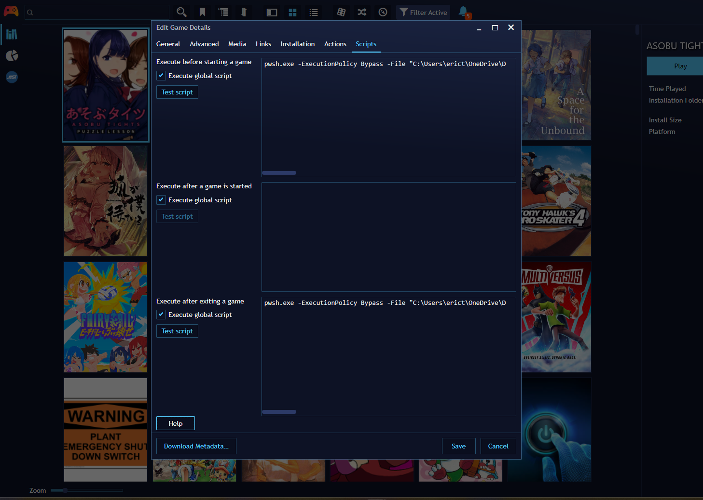

# Merge Game Saves PowerShell Script

This script allows you to merge save files from multiple sources (such as different PCs or network locations) and archive them for backup or synchronization purposes. It is especially useful for synchronizing game saves between different devices or users.

## Requirements

This assumes you have multiple PCs that are on a local SMB network, with your passwords saved, i.e. in Windows Credentials Manager, to play the same game.
PowerShell Core is used, it is possible the PowerShell included on Windows will work but this has only been tested with PowerShell 7.5.x

Playnite's feature to input a Script to Excute before starting a game and after exiting is used to make sure this runs and syncs your games properly.

## Usage

### Command Example

```powershell
pwsh.exe -ExecutionPolicy Bypass -File "C:\Path\To\MergeGames.ps1" -Path "\\<IP1>\<Location of Save Data>","\\<IP2>\<Location of Save Data>" -Archive "C:\Path\To\Archive\Folder"
```

- Replace `<IP1>` and `<IP2>` with the IP addresses or hostnames of your source machines.
- Replace `<User1>` and `<User2>` with the Windows usernames on each machine.
- Replace the rest of the file path with the folder that contains all the saves for the game.
- The `-Archive` parameter specifies the folder where merged saves will be archived.

### Example

```powershell
pwsh.exe -ExecutionPolicy Bypass -File "C:\Scripts\MergeGames.ps1" -Path "\\192.168.1.10\c\Users\Alice\AppData\Roaming\suyu\nand\user\save\0000000000000000\GAMEID","\\192.168.1.11\c\Users\Bob\AppData\Roaming\suyu\nand\user\save\0000000000000000\GAMEID" -Archive "C:\Saves\Nintendo\Switch\GameName"
```

## Using with Playnite

You can configure Playnite to run this script automatically before and after launching a game to keep your saves synchronized.

### Steps:
1. Open Playnite and go to the game you want to synchronize saves for.
2. Edit the game and go to the **Scripts** tab.
3. Add the following command to the **Pre-Script** and/or **Post-Script** fields:

   ```powershell
   pwsh.exe -ExecutionPolicy Bypass -File "C:\Path\To\MergeGames.ps1" -Path "\\<IP1>\<Location of Save Data>","\\<IP2>\<Location of Save Data>" -Archive "C:\Path\To\Archive\Folder"
   ```

4. Adjust the paths and parameters as needed for your setup.

#### Example Playnite Script Settings



*Above: Playnite's script settings for a game, showing where to add the PowerShell command.*

## Parameters
- `-Path` (required): Comma-separated list of save directories to merge.
- `-Archive` (optional, recommended): Path to the folder where the merged save will be archived.


## Notes
- Ensure network paths are accessible and you have the necessary permissions.
- The script can be run manually or automated via Playnite or other launchers.
- For best results, run the script both before and after playing to synchronize the latest saves.
- Currently, archiving will create a new copy of your save file every time it runs. This can potentially use a lot of space
---